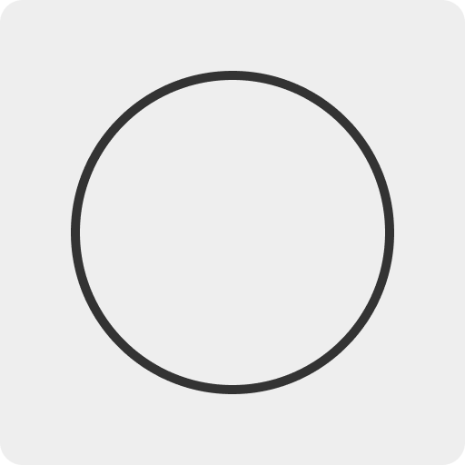
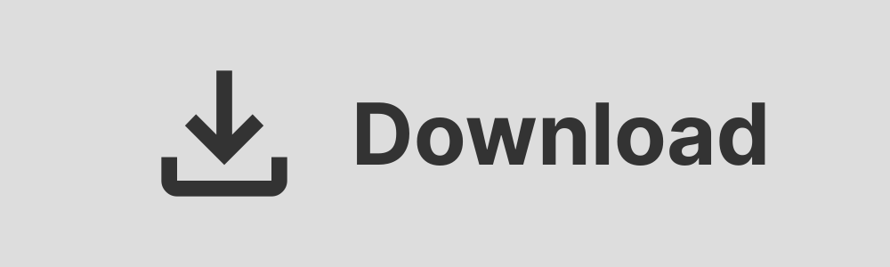
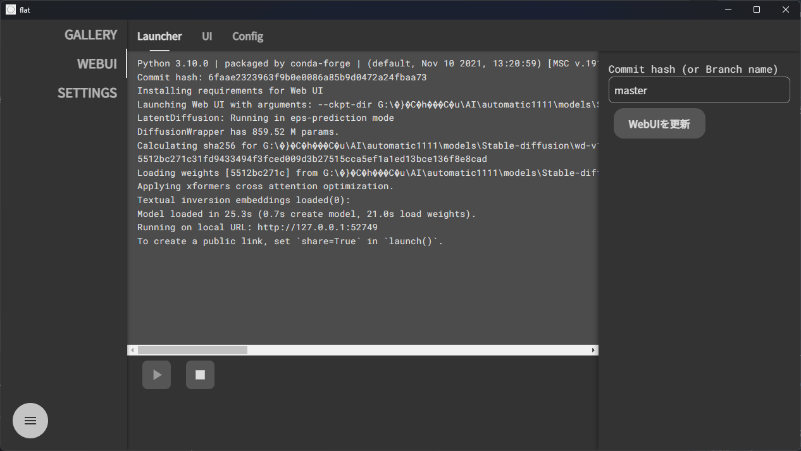
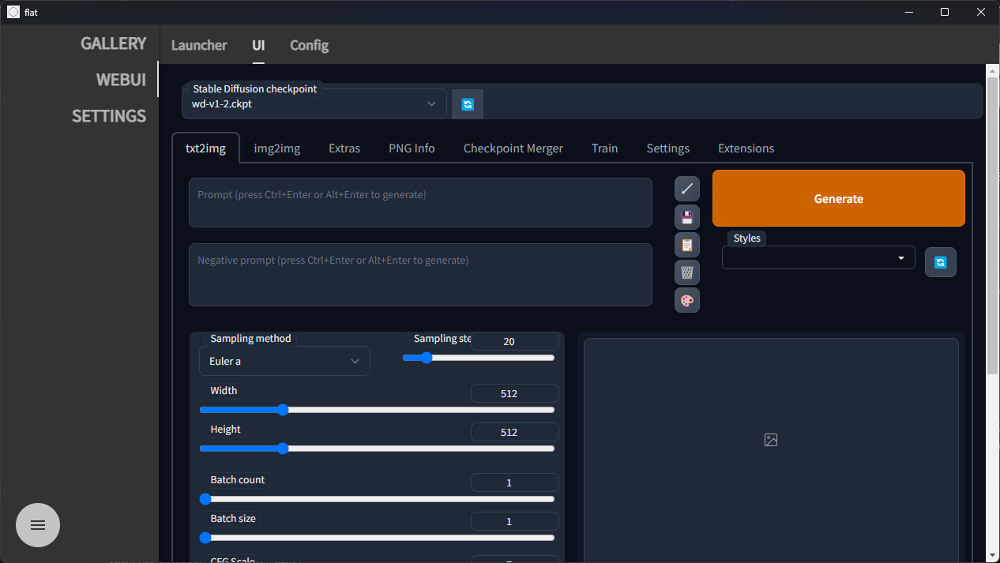
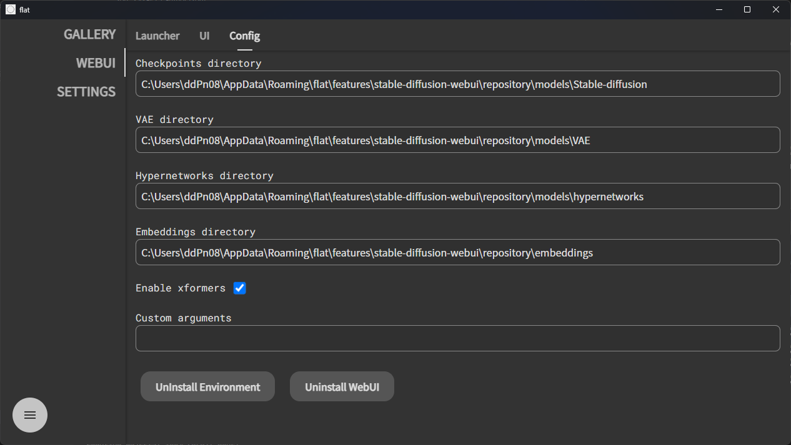
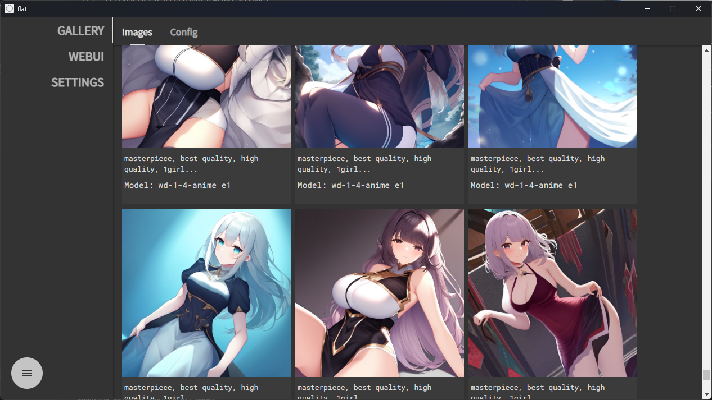
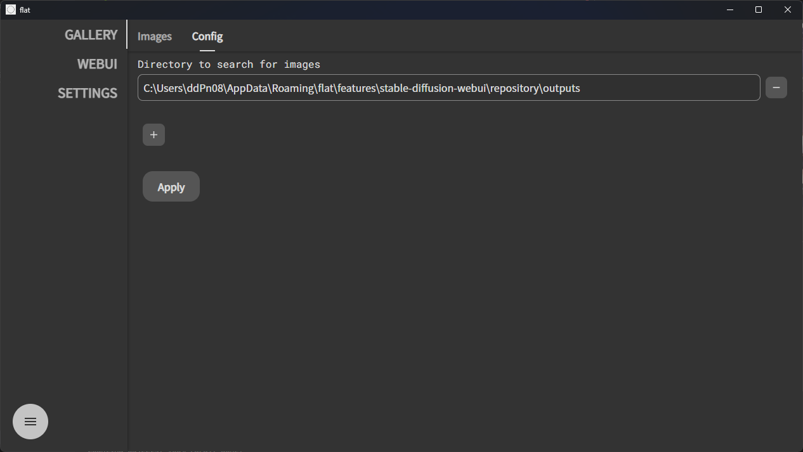

<h1 align="center">flat</h1>

AI画像生成のオールインワン (になるはず...)

 

---

[日本語](./README-ja.md)

[English](./README.md)

---

> **Warning**
>
> 🚧 これはベータリリースです。予期せぬエラーが発生する可能性があります。
>
> エラーが発生した場合は開発者にお伝えください。

# インストール方法

👇 インストール方法はこちらをご覧ください。

[installation-ja.md](/docs/installation-ja.md)

 

# 機能

## AUTOMATIC1111 Stable Diffusion Webui

数クリックで StableDiffusionWebUI を起動できます。

Python のインストールや Git の操作は必要ありません。

 

 

## Image gallery

生成した画像をプロンプト等の情報とともに一覧に表示します。

画像のフォルダは自由に設定できます。

