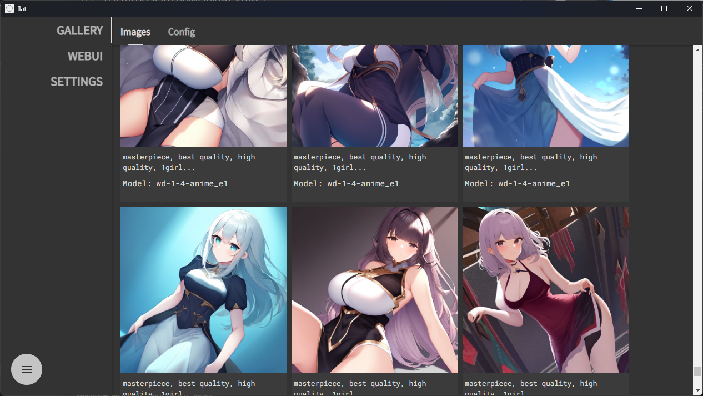
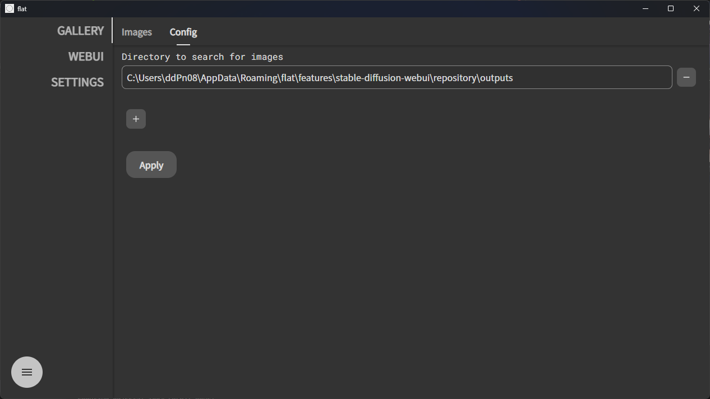

<h1 align="center">flat</h1>

All-in-one image generation AI (to be...)

 

---

[日本語](./README-ja.md)

[English](./README.md)

---

> **Warning**
>
> 🚧 This is a beta release. Unexpected errors may occur.
>
> If you get an error, please let the developer know.

# How to install

👇Click here for installation instructions.

[installation.md](/docs/installation.md)

# Features

## AUTOMATIC1111 Stable Diffusion Webui

Launch StableDiffusionWebUI with just a few clicks.

No Python installation or repository cloning required!

 

## Image gallery

Displays generated images in a list with information such as prompts.
The image folder can be set freely.

